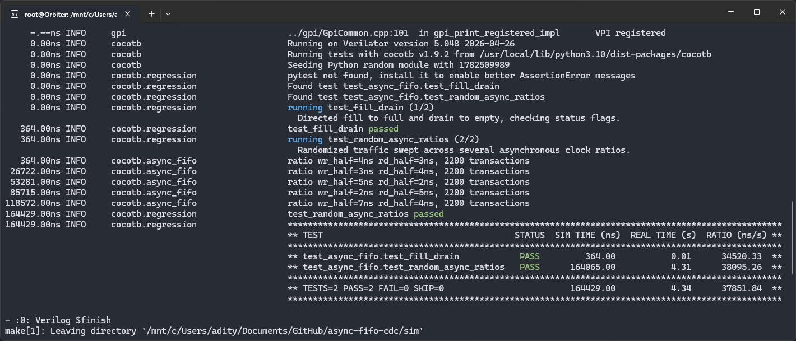
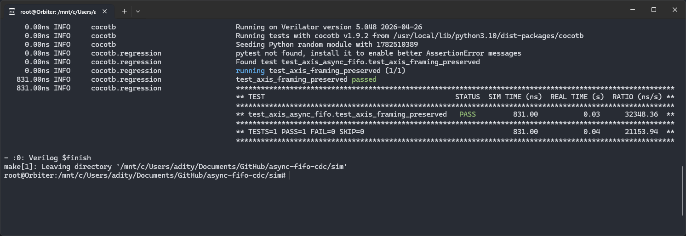
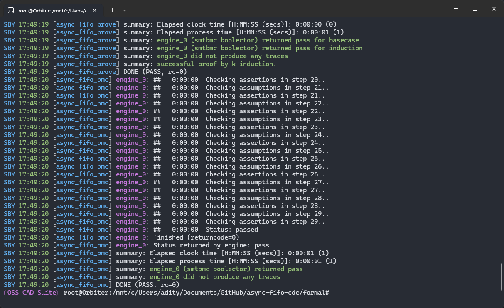
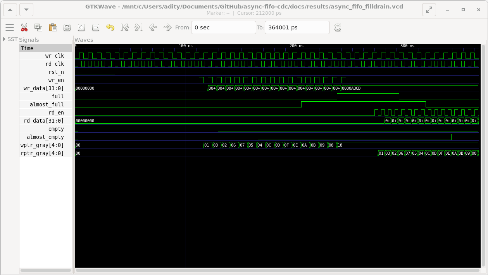
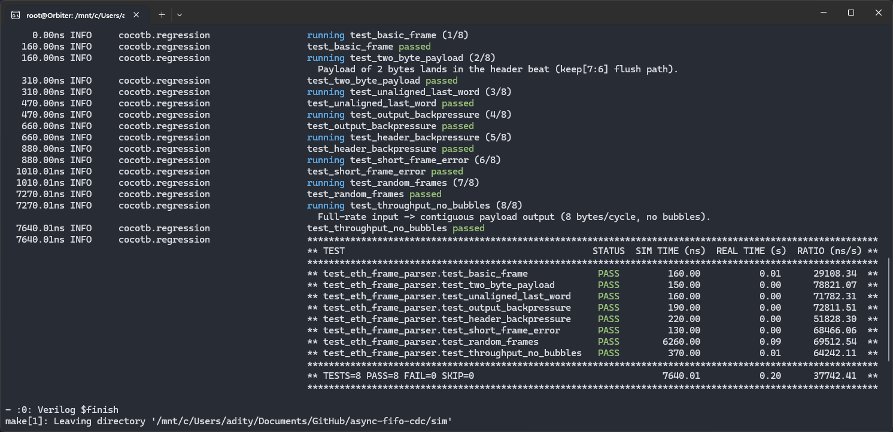
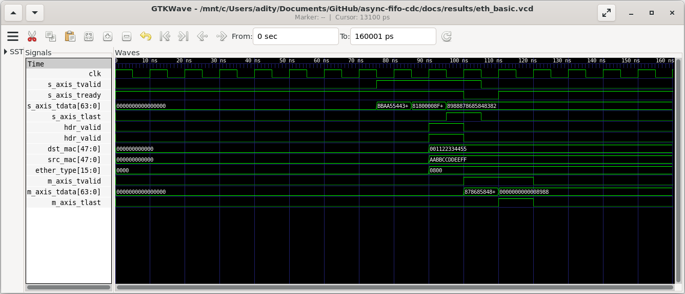
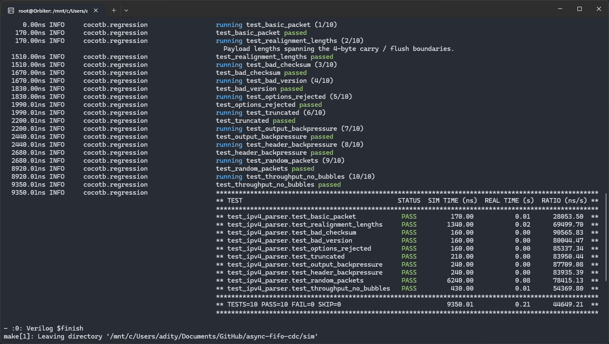
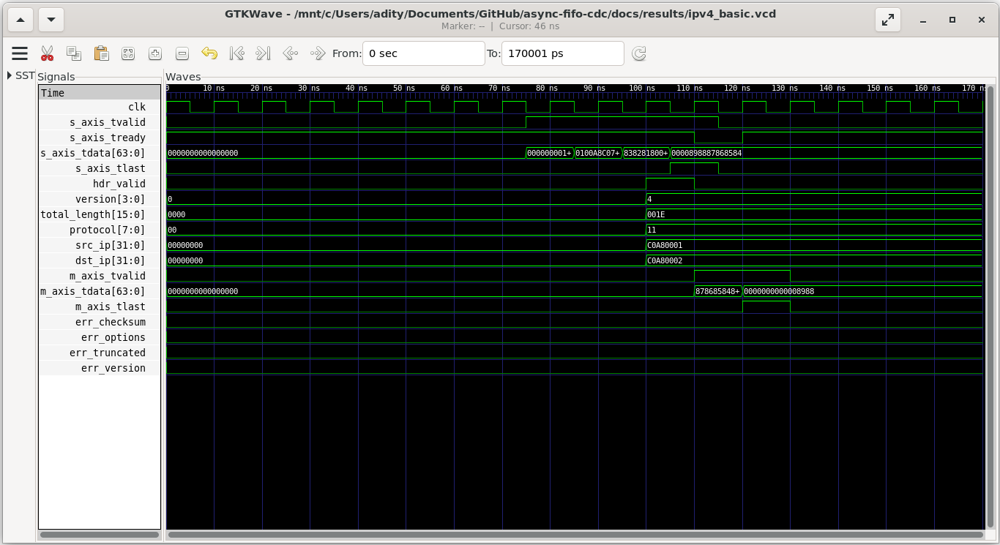

# async-fifo-cdc

An asynchronous FIFO for crossing data between two unrelated clock domains, an
AXI-Stream wrapper around it, a shared definitions package, and an Ethernet
frame parser. Verified with cocotb + Verilator and formally proven with
SymbiYosys.

## What's implemented

**Async FIFO (CDC core)** — `src/rtl/fifo/`
- `async_fifo.sv` — top wrapper, parameterized by `DATA_WIDTH` and `ADDR_WIDTH`
  (depth = 2^`ADDR_WIDTH`). Also exposes `almost_full`/`almost_empty` with
  configurable thresholds.
- `fifo_mem.sv` — dual-clock memory (write port on the write clock, read port on
  the read clock).
- `wptr_full.sv` / `rptr_empty.sv` — binary+gray pointers; generate `full` /
  `empty` in their own clock domains.
- `sync_w2r.sv` / `sync_r2w.sv` — 2-flop synchronizers carrying each gray pointer
  into the opposite clock domain.
- `reset_sync.sv` — per-domain reset synchronizer (async assert, sync deassert).

Pointers are `ADDR_WIDTH+1` bits (extra MSB separates full from empty) and cross
domains in gray code (one bit changes per step, so a metastable sample can only
resolve to the old or new value).

**AXI-Stream wrapper** — `src/rtl/fifo/axis_async_fifo.sv`
- Presents AXI-Stream (`tdata`/`tkeep`/`tlast`/`tvalid`/`tready`) on both clock
  domains. Packs `{tlast, tkeep, tdata}` into the FIFO word so frame boundaries
  survive the crossing. A 2-entry output buffer turns the FIFO core into a
  full-throughput AXIS source with backpressure.

**Shared definitions** — `src/rtl/top/pkg_defines.sv`
- AXI-Stream width defaults, the `{tlast,tkeep,tdata}` packing convention,
  packed Ethernet/IPv4/UDP header structs, and protocol constants.

**Ethernet frame parser** — `src/rtl/parser/eth_frame_parser.sv`
- 64-bit AXI-Stream, cut-through. Extracts destination MAC, source MAC, and
  EtherType, emits the payload, and flags short/truncated frames. Assumes the
  MAC/PHY layer has already stripped preamble/SFD and FCS (parsing starts at the
  destination MAC).

**IPv4 parser** — `src/rtl/parser/ipv4_parser.sv`
- 64-bit AXI-Stream, cut-through. Extracts version/IHL, total length, protocol,
  and src/dst IP; validates the 20-byte header checksum; emits the realigned L4
  payload. Restricted to standard 20-byte headers — options (IHL>5), bad version,
  bad checksum, and truncated frames are flagged and the packet is dropped.

**Testbenches / properties**
- `tb/axis.py` — reusable AXI-Stream source/sink BFM.
- `tb/test_async_fifo.py`, `tb/test_axis_async_fifo.py`, `tb/test_eth_frame_parser.py`,
  `tb/test_ipv4_parser.py`, `tb/ref_model.py`, `tb/ref_eth.py`, `tb/ref_ipv4.py`
  — cocotb tests + Python reference models.
- `src/tb/async_fifo_assertions.sv` — SystemVerilog assertions bound into the
  FIFO (active during simulation).
- `formal/async_fifo.sby` + `formal/fifo_props.sv` — SymbiYosys formal setup and
  safety properties for the FIFO.

## Verification results

- **FIFO simulation:** directed fill/drain plus 11,000 random transactions across
  5 asynchronous clock ratios — zero data loss, correct ordering, SVA active.
- **AXIS wrapper:** `tlast`/`tkeep`/`tdata` verified intact across the CDC under
  backpressure on both sides.
- **FIFO formal (SymbiYosys, k-induction):** proven that the FIFO can never
  overflow, never write when full, and never underflow — for all reachable
  states and all clock-phase relationships. (bmc, cover, and prove all pass.)
- **Ethernet parser:** 8 cocotb tests pass (lint clean) — directed edge cases
  (2-byte/unaligned payloads, output + header backpressure), short-frame error,
  40 constrained-random frames against a Python reference, and an 8 bytes/cycle
  no-bubble throughput check.
- **IPv4 parser:** 10 cocotb tests pass (lint clean) — field extraction, header
  checksum (good + corrupted), options/bad-version/truncated drops, payload
  realignment across the 4-byte boundary, both-side backpressure, 40 random
  packets against a Python reference, and a no-bubble throughput check.

Result captures are in `docs/results/` (raw logs/VCD alongside each image).

Async FIFO core — fill/drain + 11k random transactions across 5 async ratios:



AXIS framing preserved across the CDC:



Formal proof (SymbiYosys, k-induction):



Fill-to-full then drain-to-empty waveform:



Ethernet frame parser — 8 cocotb tests (directed edge cases + 40 random frames + throughput):



Ethernet frame parse — header fields extracted (`hdr_valid`), payload streamed out:



IPv4 parser — 10 cocotb tests (fields, checksum, drops, realignment, random, throughput):



IPv4 parse — checksum validated, fields extracted, payload streamed out:



## Run

```bash
# Simulation (Verilator + cocotb), from sim/
cd sim
make MODULE=test_async_fifo       TOPLEVEL=async_fifo
make MODULE=test_axis_async_fifo  TOPLEVEL=axis_async_fifo
make MODULE=test_eth_frame_parser TOPLEVEL=eth_frame_parser
make MODULE=test_ipv4_parser      TOPLEVEL=ipv4_parser

# Formal (SymbiYosys), from formal/
cd formal
sby -f async_fifo.sby
```

Simulation runs end with `TESTS=… PASS=… FAIL=0`; the formal run ends with
`DONE (PASS)` for each task.
